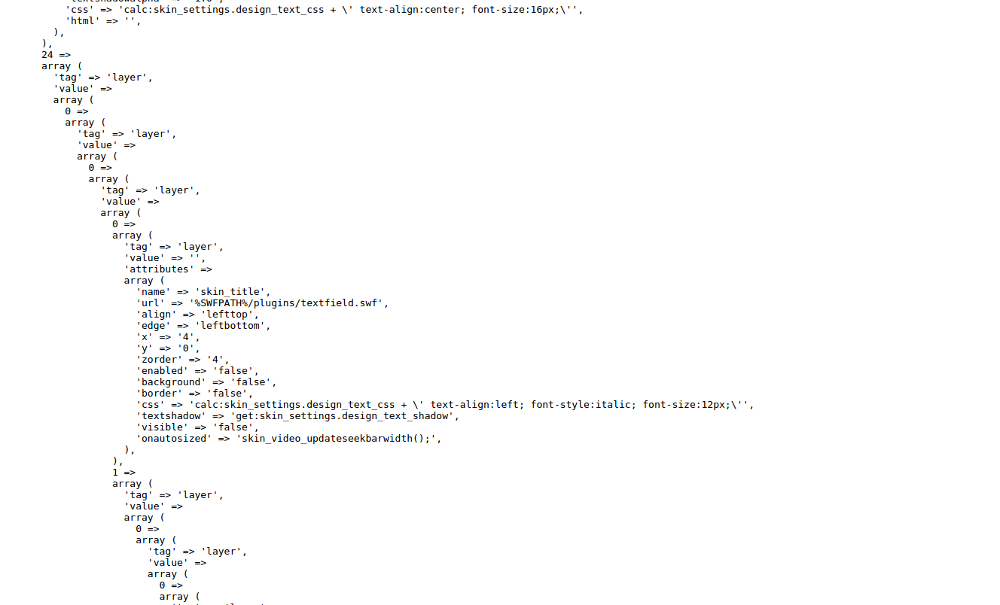
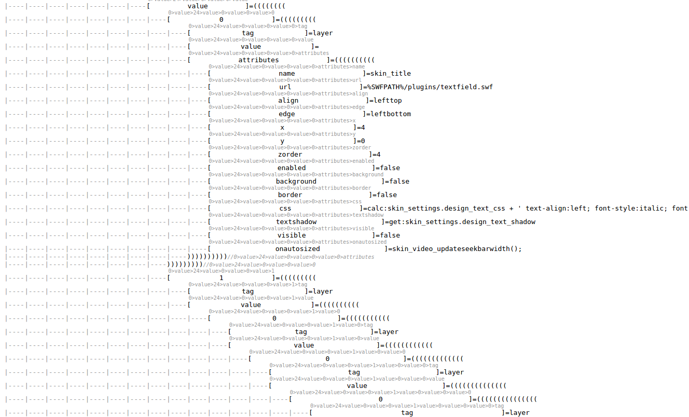

README

### 格式化输出显示对象、数组的维度，便于定位

一般情况下我们使用php的print_r或者时var_export打印的时候，输出的数组效果如下：

如果我们找到某个值，想得知它依次的键值的话，则没有一个好的方法，现在我们使用FormatShowObject，则可以很方便的知道所属的键值



#####使用方法如下
```php
$format = new FormatShowObject();
		 $format->show($array);
```


